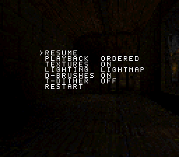
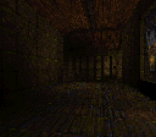
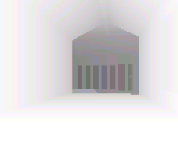
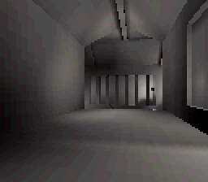

# SNES Quake

This repository builds SNES Quake, a BSP software renderer for
[Super FX 3](https://github.com/LimitedRunGames-Tech/snes-fx3). It contains the
renderer source, its reproducible asset pipeline, and the tools required to
build the ROM. It is a renderer demonstration, not a complete Quake port.

[License](LICENSE) | [Third-party notices](THIRD_PARTY.md)

## Renderer

- Preprocesses BSP geometry, visibility, textures, and lightmaps.
- Uses the BSP tree and precomputed visibility to select the visible world.
- Rasterizes span-based textured polygons and lightmaps on Super FX 3.
- Renders dynamic brush models such as doors and buttons.
- Presents a 128x112 8bpp framebuffer as crisp 2x pixels at 256x224.
- Provides real-time replay and an interactive fly camera with a settings menu.

## Performance

The resulting ROM sustains **1.904 fresh FPS** with textures, lightmaps,
and dynamic brushes enabled across the complete 149-view fixed-step benchmark:
148 new presentations in 4,671 emulated NTSC PPU frames. All 2,136,064 output
pixels match the independent C++ reference renderer.

In a separate equal-duration, 480-PPU-frame realtime window:

| Dynamic brushes | Fresh presentations | Fresh FPS |
| :--- | ---: | ---: |
| On | 15 | **1.878** |
| Off (world only) | 19 | **2.379** |

Fresh FPS counts newly completed framebuffers per emulated SNES second;
repeated display frames do not count. Emulator fast-forward changes wall-clock
test time, not these emulated results. The benchmark's 2 Hz sampling selects
camera poses; it is not the renderer frame rate.

## Screenshots

|  |  |
| :---: | :---: |
| **Runtime menu** | **Textures + lightmaps** |
|  |  |
| **Distance shading only** | **Lightmaps only** |

## Agentic development

This codebase was generated and refined through agentic programming with
Codex 5.6 Sol. A human directed the goals, reviewed the results, and selected
the next experiments. Rather than producing the project in one pass, Codex
inspected the repository, edited code and tooling, built ROMs, ran repeatable
tests, measured the results, and committed small validated changes.

A custom-instrumented Mesen provides programmatic emulator control,
deterministic replay, framebuffer capture, memory inspection, and performance
telemetry. A C++ reference renderer supplies the ground truth for deterministic
demo frames and rendering behavior. Optimizations are developed iteratively
and retained only when they improve measured performance while preserving
reference-renderer parity; they must also remain useful to the interactive fly
camera rather than serving only the fixed-step benchmark.

## Build the ROM

The ROM is not included in this repository; generate it locally with either
build script. Both scripts initialize the pinned libSFX and cc65 submodules,
extract `ID1/PAK0.PAK`, generate the ROM assets, and assemble the program.
Python 3.10+ and Git are required on both platforms.

On Ubuntu, install the native compiler, GNU Make, and libarchive `bsdtar`, then
run the Linux entry point:

```sh
sudo apt update
sudo apt install build-essential git libarchive-tools python3
git clone <repository-url>
cd <repository-directory>
sh ./build.sh
```

On Windows 10/11, install MSYS2 UCRT64 with GNU Make and a C compiler, then run:

```powershell
git clone <repository-url>
cd <repository-directory>
./build.ps1
```

The finished ROM is `src/snes_quake/quake.sfc`. Verify an existing build
without rebuilding it with `sh ./build.sh --check` on Linux or
`./build.ps1 -Check` on Windows.

## Run the ROM

FX3 requires a recent
[MesenCE development build](https://github.com/nesdev-org/MesenCE#development-builds),
based on commit
[`c49fbb0`](https://github.com/nesdev-org/MesenCE/commit/c49fbb0461f87881789ca4252cbb374b8957a2e1)
or newer. Stable MesenCE 2.2.1 predates reliable FX3 support and is not
compatible with this ROM.

## Controls

- **Start** opens the settings menu; Up/Down selects an option, Left/Right or
  A changes it, and B or Start applies the settings and closes the menu.
- Select `PLAYBACK FLY` for the interactive camera. The D-pad looks around,
  X/B moves forward/back, and Y/A strafes left/right.
- **L/R** moves to the previous/next monster viewpoint. With the menu closed,
  **Select** cycles the rendering technique.

## Video

https://github.com/user-attachments/assets/30bd3a2d-66cb-4b12-97ed-a99220570a58

[Download the repository copy (MP4)](media/quake-bsp-realtime-3x.mp4).

## License

The independently authored source code, tooling, and documentation are
available under the [MIT License](LICENSE). Third-party software and material
retain their own terms; see [THIRD_PARTY.md](THIRD_PARTY.md) for the precise
scope and attributions.

## Support

SNES Quake is free and open source. Donations support its continued
development.

Feel free to open an issue with feature requests or suggestions.

Bitcoin (mainnet): [`bc1qza59dja7yjyqtd98y4qwthzpz904mrmrljwdua`](bitcoin:bc1qza59dja7yjyqtd98y4qwthzpz904mrmrljwdua)
