# SNES Quake 0.0.2

Explore Quake's **E1M3: The Necropolis** through a software renderer for
[Super FX 3](https://github.com/LimitedRunGames-Tech/snes-fx3). Replay the
shareware demo, explore with the fly camera, and switch between textures,
lightmaps, or both from the runtime menu.

This is a renderer demonstration, not a complete Quake game port.
[Build the ROM from source](docs/BUILDING.md) on Windows or Linux.

[Build](docs/BUILDING.md) · [Video](#video) ·
[Screenshots](#screenshots) · [Run](#run-the-rom) · [Controls](#controls) ·
[Limitations](#known-limitations) · [License](LICENSE)

## Video

https://github.com/user-attachments/assets/f81515b4-ee59-49ed-8862-65d98dfe2881

## Screenshots

Three views of E1M3: the hall, an interior encounter, and the ending area with
sky and fiends. Each row shows the same scene in three rendering modes.
Native Mesen captures show 128×112 rendering presented at 256×224.

| Textures + lightmaps | Textures only | Lightmaps only |
| :---: | :---: | :---: |
| 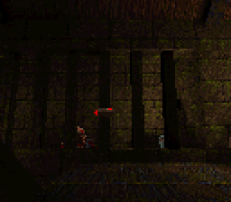 | 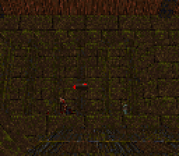 | 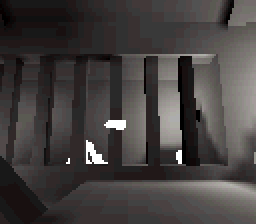 |
| **E1M3 hall: Textures + lightmaps** | **E1M3 hall: Textures only** | **E1M3 hall: Lightmaps only** |
| 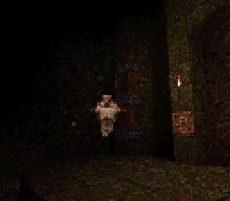 | 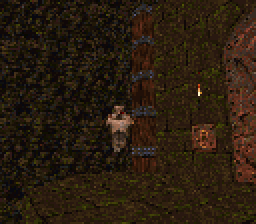 | 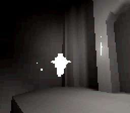 |
| **Textures + lightmaps** | **Textures only** | **Lightmaps only** |
| 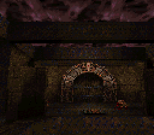 | 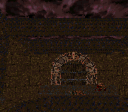 | 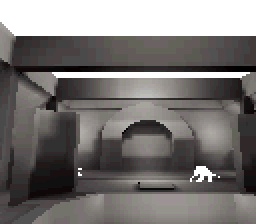 |
| **E1M3 ending with sky and fiends: Textures + lightmaps** | **E1M3 ending with sky and fiends: Textures only** | **E1M3 ending with sky and fiends: Lightmaps only** |

| Runtime menu |
| :---: |
| 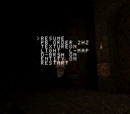 |
| **Runtime menu** |

## Reference renderer

The desktop reference tool displays the source geometry and lighting, with
playback, rendering, sound and timeline controls. These captures show the same
hall and interior moments as the SNES gallery, with textures, lighting, moving
level objects, monsters and items enabled.

**C++ reference: E1M3 hall**

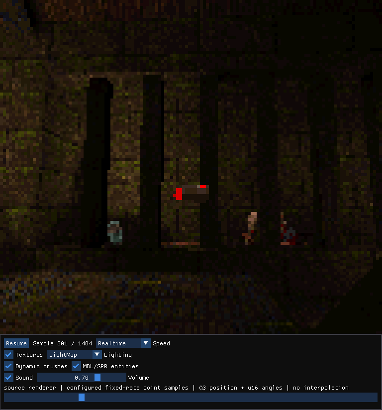

**C++ reference: E1M3 interior**

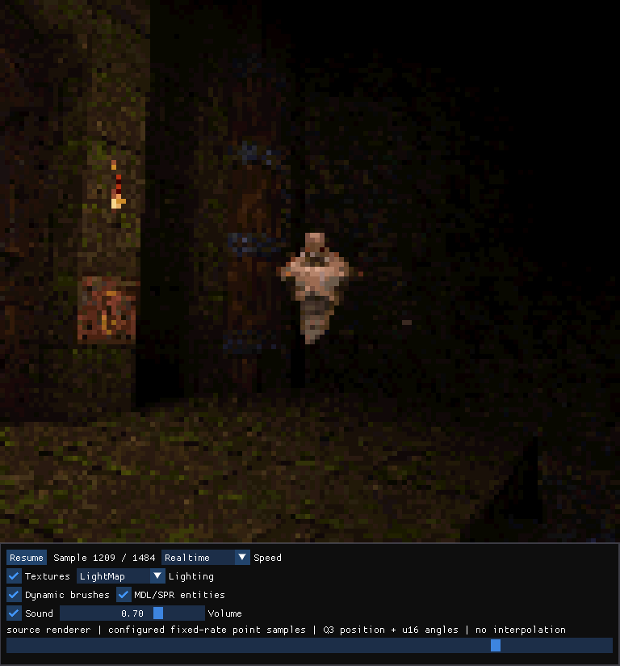

[Build and use the reference renderer](docs/REFERENCE_RENDERER.md).

## Current renderer

- Quake's original colors, textures and lighting
- Animated skies and liquids, plus moving doors, lifts and other level objects in demo and fly modes
- Detailed monster and item images, rotating weapon pickups, and sprite effects
- During demo playback, monsters, pickups and sprite effects are hidden correctly behind walls and moving doors
- Native SNES sound synchronized with realtime demo playback
- Realtime demo playback, step-by-step playback for comparisons, and a fly camera for exploring the level
- A runtime menu for rendering, playback, level objects, monsters and items, colors, and sound

## Performance

**Default realtime demo playback: 2.374 fresh FPS.**
This counts newly rendered images with textures, lighting, moving level objects,
monsters, items and sound enabled. Playback stays on time by skipping scene
updates when rendering cannot keep up.
[Measurements and benchmark details](docs/PERFORMANCE.md).

## Run the ROM

[Build from source](docs/BUILDING.md) to produce `out/snes_quake/quake.sfc`.

Requires the current **MesenCE development build**. Download it for
[Windows, Linux or macOS](https://github.com/nesdev-org/MesenCE#development-builds),
then open `quake.sfc` in the emulator.

## Controls

| Input | Action |
| --- | --- |
| **Start** | Open the runtime menu; apply changes and close it. |
| **Up/Down** in the menu | Select a setting. |
| **Left/Right** or **A** in the menu | Change the selected setting. |
| **B** in the menu | Apply settings and close the menu. |
| **Select**, menu closed | Cycle the three rendering modes. |
| **D-pad**, `PLAYBACK FLY` | Look around. |
| **X/B**, fly mode | Move forward/back. |
| **Y/A**, fly mode | Strafe left/right. |
| **L/R**, fly mode | Previous/next monster viewpoint. |

## Known limitations

- This is a renderer demonstration, not a complete Quake game port.
- The included content path is the shareware demo1.dem on maps/e1m3.bsp; gameplay, AI, save games, networking, and the Quake console are not implemented.
- Rendering is 128x112 indexed color presented at 256x224, so detail and frame rate vary substantially with scene complexity.
- Interactive fly mode is a development camera and does not provide Quake movement or collision semantics.
- In fly mode, sprites can appear through doors and other inline brush models.

## Development

The project is developed with human direction and Codex-assisted programming.
An instrumented Mesen and the C++ reference renderer provide repeatable rendering
checks and performance measurements. See [release notes](docs/RELEASE_NOTES.md)
and [build information](docs/BUILD_INFO.json).

## License

Original source code, tooling and documentation use the [MIT License](LICENSE).
Quake assets, images, video and third-party dependencies retain their own terms;
see [third-party notices](docs/THIRD_PARTY.md). This unofficial project is not
affiliated with or endorsed by id Software.

## Support

SNES Quake is free and open source. Donations support its continued
development.

Feel free to open an issue with feature requests or suggestions.

Bitcoin (mainnet): [`bc1qza59dja7yjyqtd98y4qwthzpz904mrmrljwdua`](bitcoin:bc1qza59dja7yjyqtd98y4qwthzpz904mrmrljwdua)
